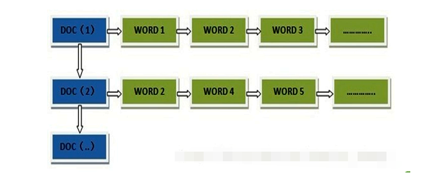
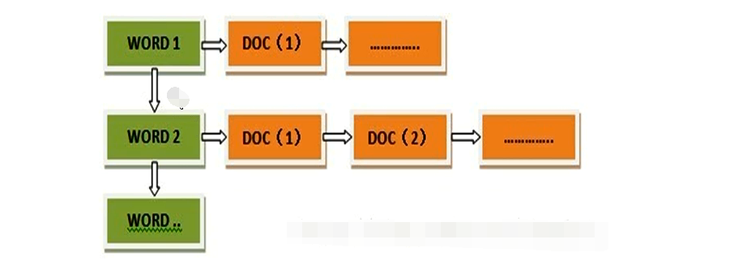
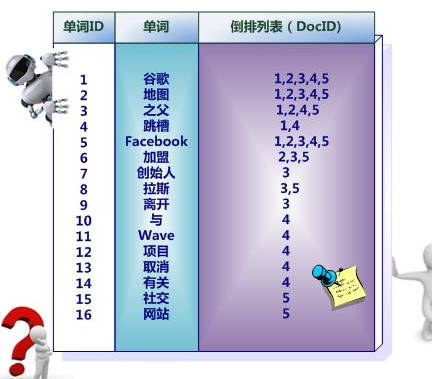
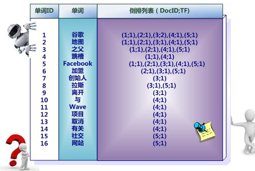

>#### 1.  什么是正向索引？

````
 在搜索引擎中每个文件都对应一个文件ID，文件内容被表示为一系列关键词的集合（实际上在搜索引擎索引库中，关键词也已经转换为关键词ID）。例如“文档1”经过分词，提取了20个关键词，每个关键词都会记录它在文档中的出现次数和出现位置。
````

**得到正向索引的结构如下：**

​    “文档1”的ID > 单词1：出现次数，出现位置列表；单词2：出现次数，出现位置列表；…………。

​    “文档2”的ID > 此文档出现的关键词列表。



**用户查找的缺点**

````
当用户在主页上搜索关键词“华为手机”时，假设只存在正向索引（forward index），那么就需要扫描索引库中的所有文档，找出所有包含关键词“华为手机”的文档，再根据打分模型进行打分，排出名次后呈现给用户。因为互联网上收录在搜索引擎中的文档的数目是个天文数字，这样的索引结构根本无法满足实时返回排名结果的要求。
````

>#### 2.  解決方法： 倒排索引也叫反向索引

**所以，搜索引擎会将正向索引重新构建为倒排索引**，即把文件ID对应到关键词的映射转换为**关键词到文件ID的映射**，每个关键词都对应着一系列的文件，这些文件中都出现这个关键词。

​    得到**倒排索引**的结构如下：

​    “关键词1”：“文档1”的ID，“文档2”的ID，…………。

​    “关键词2”：带有此关键词的文档ID列表。




## 3.倒排索引简单实例

`在图4中，“单词ID”一栏记录了每个单词的单词编号，第二栏是对应的单词，第三栏即每个单词对应的倒排列表。比如单词“谷歌”，其单词编号为1，倒排列表为{1,2,3,4,5}，说明文档集合中每个文档都包含了这个单词。`



`带有单词频率信息的倒排索引`



**为什么需要词频信息**

````
 “文档频率信息”代表了在文档集合中有多少个文档包含某个单词，之所以要记录这个信息，其原因与单词频率信息一样，这个信息在搜索结果排序计算中是非常重要的一个因子。而单词在某个文档中出现的位置信息并非索引系统一定要记录的，在实际的索引系统里可以包含，也可以选择不包含这个信息，之所以如此，因为这个信息对于搜索系统来说并非必需的，位置信息只有在支持“短语查询”的时候才能够派上用场。
````

