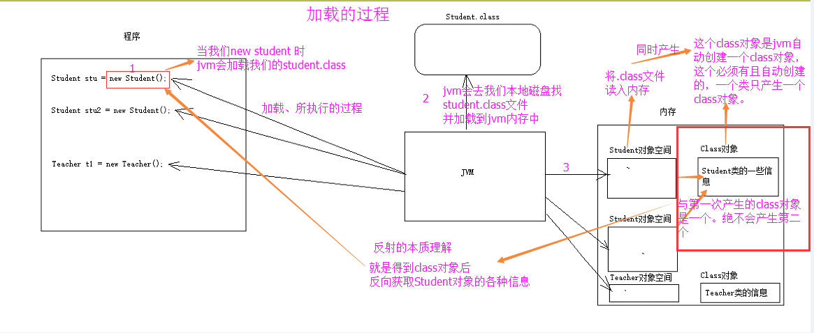

#### 1: 反射的概述

**JAVA反射机制是在运行状态中，对于任意一个类，都能够知道这个类的所有属性和方法；对于任意一个对象，都能够调用它的任意一个方法和属性；这种动态获取的信息以及动态调用对象的方法的功能称为java语言的反射机制。要想解剖一个类,必须先要获取到该类的字节码文件对象。而解剖使用的就是Class类中的方法.所以先要获取到每一个字节码文件对应的Class类型的对象.**


#### 2： Class对象的由来 

**2.1: 对象的由来是将class文件读入内存，并为之创建一个Class对象。**

**2.2: 在运行期间，一个类，只有一个Class对象产生。**



#### 3: 获取class对象的三种方式

``1.1 Object ——> getClass(); ``

``1.2 任何数据类型（包括基本数据类型）都有一个“静态”的class属性``

`` 1.3 通过Class类的静态方法：forName（String  className）(常用)`` 

```java
@Test
public  void  test2() throws ClassNotFoundException {

    CityNumberEntity cityNumberEntity = new CityNumberEntity();
    // 方式一
    Class<? extends CityNumberEntity> aClass = cityNumberEntity.getClass();
    System.out.println(aClass);
    // 方式二
    Class<CityNumberEntity> cityNumberEntityClass = CityNumberEntity.class;
    System.out.println(cityNumberEntityClass);
    // 方式三  注意此字符串必须是真实路径，就是带包名的类路径，包名.类名
    Class<?> cityNumberEntity1 = Class.forName("com.marcpoint.modules.device.entity.CityNumberEntity");
    System.out.println(cityNumberEntity1);
}
```


#### 反射的使用：

**4.1： 反射获取成员变量**

````java
package fanshe.field;
import java.lang.reflect.Field;
/*
 * 获取成员变量并调用：
 * 
 * 1.批量的
 * 		1).Field[] getFields():获取所有的"公有字段"
 * 		2).Field[] getDeclaredFields():获取所有字段，包括：私有、受保护、默认、公有；
 * 2.获取单个的：
 * 		1).public Field getField(String fieldName):获取某个"公有的"字段；
 * 		2).public Field getDeclaredField(String fieldName):获取某个字段(可以是私有的)
 * 
 * 	 设置字段的值：
 * 		Field --> public void set(Object obj,Object value):
 * 					参数说明：
 * 					1.obj:要设置的字段所在的对象；
 * 					2.value:要为字段设置的值；
 * 
 */
public class Fields {
 
		public static void main(String[] args) throws Exception {
			//1.获取Class对象
			Class stuClass = Class.forName("fanshe.field.Student");
			//2.获取字段
			System.out.println("************获取所有公有的字段********************");
			Field[] fieldArray = stuClass.getFields();
			for(Field f : fieldArray){
				System.out.println(f);
			}
			System.out.println("************获取所有的字段(包括私有、受保护、默认的)********************");
			fieldArray = stuClass.getDeclaredFields();
			for(Field f : fieldArray){
				System.out.println(f);
			}
			System.out.println("*************获取公有字段**并调用***********************************");
			Field f = stuClass.getField("name");
			System.out.println(f);
			//获取一个对象
			Object obj = stuClass.getConstructor().newInstance();//产生Student对象--》Student stu = new Student();
			//为字段设置值
			f.set(obj, "刘德华");//为Student对象中的name属性赋值--》stu.name = "刘德华"
			//验证
			Student stu = (Student)obj;
			System.out.println("验证姓名：" + stu.name);
			
			
			System.out.println("**************获取私有字段****并调用********************************");
			f = stuClass.getDeclaredField("phoneNum");
			System.out.println(f);
			f.setAccessible(true);//暴力反射，解除私有限定
			f.set(obj, "18888889999");
			System.out.println("验证电话：" + stu);
			
		}
	}
````

**反射获取成员方法**

````java
package fanshe.method;
 
import java.lang.reflect.Method;
 
/*
 * 获取成员方法并调用：
 * 
 * 1.批量的：
 * 		public Method[] getMethods():获取所有"公有方法"；（包含了父类的方法也包含Object类）
 * 		public Method[] getDeclaredMethods():获取所有的成员方法，包括私有的(不包括继承的)
 * 2.获取单个的：
 * 		public Method getMethod(String name,Class<?>... parameterTypes):
 * 					参数：
 * 						name : 方法名；
 * 						Class ... : 形参的Class类型对象
 * 		public Method getDeclaredMethod(String name,Class<?>... parameterTypes)
 * 
 * 	 调用方法：
 * 		Method --> public Object invoke(Object obj,Object... args):
 * 					参数说明：
 * 					obj : 要调用方法的对象；
 * 					args:调用方式时所传递的实参；
):
 */
public class MethodClass {
 
	public static void main(String[] args) throws Exception {
		//1.获取Class对象
		Class stuClass = Class.forName("fanshe.method.Student");
		//2.获取所有公有方法
		System.out.println("***************获取所有的”公有“方法*******************");
		stuClass.getMethods();
		Method[] methodArray = stuClass.getMethods();
		for(Method m : methodArray){
			System.out.println(m);
		}
		System.out.println("***************获取所有的方法，包括私有的*******************");
		methodArray = stuClass.getDeclaredMethods();
		for(Method m : methodArray){
			System.out.println(m);
		}
		System.out.println("***************获取公有的show1()方法*******************");
		Method m = stuClass.getMethod("show1", String.class);
		System.out.println(m);
		//实例化一个Student对象
		Object obj = stuClass.getConstructor().newInstance();
		m.invoke(obj, "刘德华");
		
		System.out.println("***************获取私有的show4()方法******************");
		m = stuClass.getDeclaredMethod("show4", int.class);
		System.out.println(m);
		m.setAccessible(true);//解除私有限定
		Object result = m.invoke(obj, 20);//需要两个参数，一个是要调用的对象（获取有反射），一个是实参
		System.out.println("返回值：" + result);
		
		
	}
}

````

**4.3： 反射获取构造方法**

````java
package fanshe;
 
import java.lang.reflect.Constructor;
 
 
/*
 * 通过Class对象可以获取某个类中的：构造方法、成员变量、成员方法；并访问成员；
 * 
 * 1.获取构造方法：
 * 		1).批量的方法：
 * 			public Constructor[] getConstructors()：所有"公有的"构造方法
            public Constructor[] getDeclaredConstructors()：获取所有的构造方法(包括私有、受保护、默认、公有)
     
 * 		2).获取单个的方法，并调用：
 * 			public Constructor getConstructor(Class... parameterTypes):获取单个的"公有的"构造方法：
 * 			public Constructor getDeclaredConstructor(Class... parameterTypes):获取"某个构造方法"可以是私有的，或受保护、默认、公有；
 * 		
 * 			调用构造方法：
 * 			Constructor-->newInstance(Object... initargs)
 */
public class Constructors {
 
	public static void main(String[] args) throws Exception {
		//1.加载Class对象
		Class clazz = Class.forName("fanshe.Student");
		
		
		//2.获取所有公有构造方法
		System.out.println("**********************所有公有构造方法*********************************");
		Constructor[] conArray = clazz.getConstructors();
		for(Constructor c : conArray){
			System.out.println(c);
		}
		
		
		System.out.println("************所有的构造方法(包括：私有、受保护、默认、公有)***************");
		conArray = clazz.getDeclaredConstructors();
		for(Constructor c : conArray){
			System.out.println(c);
		}
		
		System.out.println("*****************获取公有、无参的构造方法*******************************");
		Constructor con = clazz.getConstructor(null);
		//1>、因为是无参的构造方法所以类型是一个null,不写也可以：这里需要的是一个参数的类型，切记是类型
		//2>、返回的是描述这个无参构造函数的类对象。
	
		System.out.println("con = " + con);
		//调用构造方法
		Object obj = con.newInstance();
	//	System.out.println("obj = " + obj);
	//	Student stu = (Student)obj;
		
		System.out.println("******************获取私有构造方法，并调用*******************************");
		con = clazz.getDeclaredConstructor(char.class);
		System.out.println(con);
		//调用构造方法
		con.setAccessible(true);//暴力访问(忽略掉访问修饰符)
		obj = con.newInstance('男');
	}
	
}
````

