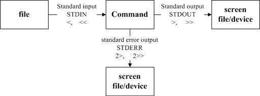

# 数据导向流：

**重定向文件输入和输出**




````shell
standard output 与 standard error output
简单的说，标准输出指的是“指令执行所回传的正确的讯息”，而标准错误输出可理解为“ 指令执行失败后，所回传的错误讯息”。举个简单例子来说，我们的系统默认有 /etc/crontab 但却无 /etc/vbirdsay， 此时若下达“ cat /etc/crontab /etc/vbirdsay ”这个指令时，cat 会进行：

标准输出：读取 /etc/crontab 后，将该文件内容显示到屏幕上；

标准错误输出：因为无法找到 /etc/vbirdsay，因此在屏幕上显示错误讯息
不管正确或错误的数据都是默认输出到屏幕上，所以屏幕当然是乱乱的！那能不能通过某些机制将这两股数据分开呢？ 当然可以啊！那就是数据流重导向的功能啊！数据流重导向可以将 standard output （简称 stdout） 与 standard error output （简称 stderr） 分别传送到其他的文件或设备去，而分别传送所用的特殊字符则如下所示：

标准输入　　（stdin） ：代码为 0 ，使用 < 或 << ；

标准输出　　（stdout）：代码为 1 ，使用 > 或 >> ；
标准错误输出（stderr）：代码为 2 ，使用 2> 或 2>> ；
为了理解 stdout 与 stderr ，我们先来进行一个范例的练习：
````

**数据输出**

``1> ：以覆盖的方法将“正确的数据”输出到指定的文件或设备上；``

``1>>：以累加的方法将“正确的数据”输出到指定的文件或设备上；``

``2> ：以覆盖的方法将“错误的数据”输出到指定的文件或设备上；``

``2>>：以累加的方法将“错误的数据”输出到指定的文件或设备上；``


#### 将文件输入到不同的文件中去：

````shell
范例三：承范例二，将 stdout 与 stderr 分存到不同的文件去
find /home -name .bashrc 1>> list_right 2>> list_error
````

#### 将错误文件的信息丢经垃圾桶

````shell
find  /home -name 'bashrc'  2>/dev/null
````

#### 将标准输出和错误输出都重定向到同一个文件

``find /home -name "a*" >> text.txt 2>&1``


#### 标准输入:

````shell
范例六：利用 cat 指令来创建一个文件的简单流程
[dmtsai@study ~]$ cat > catfile
testing
cat file test
&lt;==这里按下 [ctrl]+d 来离开
[dmtsai@study ~]$ cat catfile
testing
cat file test
````


````shell
[dmtsai@study ~]$ cat > catfile >> "eof"
&gt; This is a test.
&gt; OK now stop
&gt; eof  &lt;==输入这关键字，立刻就结束而不需要输入 [ctrl]+d
[dmtsai@study ~]$ cat catfile
This is a test.
OK now stop     &lt;==只有这两行，不会存在关键字那一行！
````


## 文件重定向的几种写法：

````shell
描述符的重定向还有下面的几种用法：

1：你可以将stderr单独定向到一个文件，将stdout重定向到另一个文件：
cmd 2>stderr.txt 1>stdout.txt

2： 也可以利用下面的方法，将stderr转换成stdout，使得stderr和stdout都被重新定向到同一个文件中：
cmd> output.txt 2>&1

3：或者采用这个方法（这个经常用到，我个人比较喜欢用这个，少写几个字符(*^__^*) ）
cmd &> output.txt
cmd >& output.txt  # 两个表达式效果一样哒~


````

